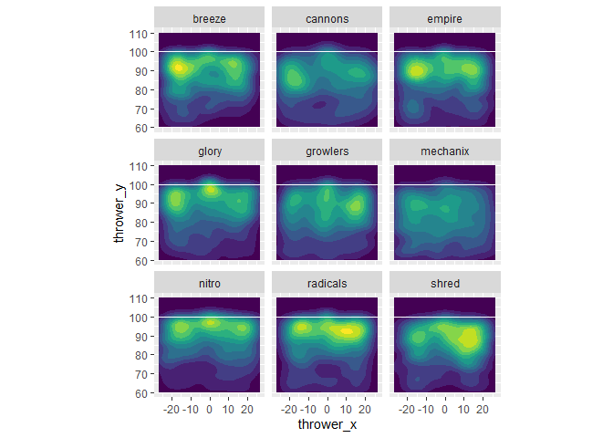
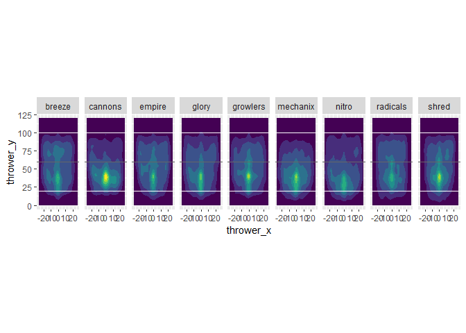
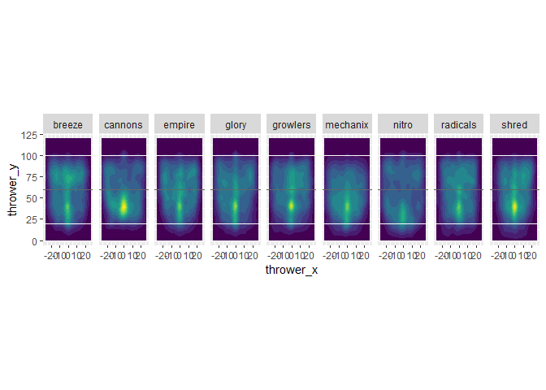
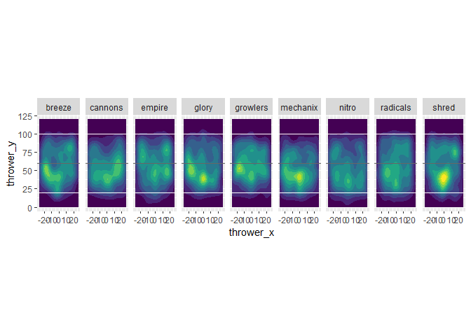
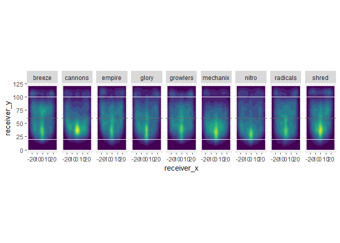
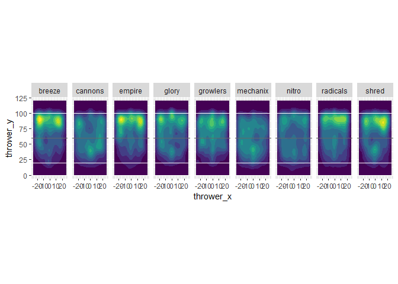
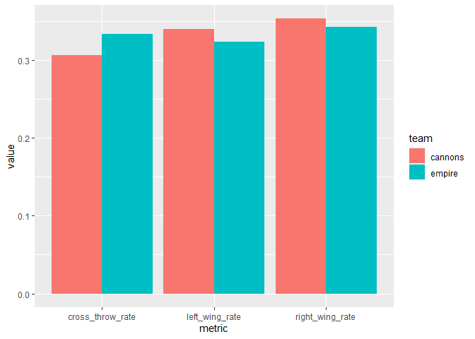
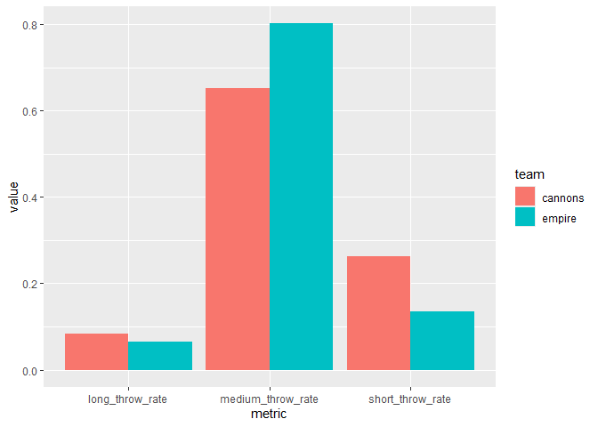
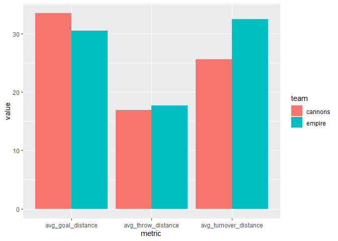

#### 0. Read the team statistics data

The original CSV file is created using the `04_exploring_teams_data.qmd`
file.

``` r
# Read the file and extract information of different teams
# (underperforming, mediocre, and elite teams)
rm(list = ls())
library(tidyverse)
```

    ── Attaching core tidyverse packages ──────────────────────── tidyverse 2.0.0 ──
    ✔ dplyr     1.2.1     ✔ readr     2.2.0
    ✔ forcats   1.0.1     ✔ stringr   1.6.0
    ✔ ggplot2   4.0.3     ✔ tibble    3.3.1
    ✔ lubridate 1.9.5     ✔ tidyr     1.3.2
    ✔ purrr     1.2.2     
    ── Conflicts ────────────────────────────────────────── tidyverse_conflicts() ──
    ✖ dplyr::filter() masks stats::filter()
    ✖ dplyr::lag()    masks stats::lag()
    ℹ Use the conflicted package (<http://conflicted.r-lib.org/>) to force all conflicts to become errors

``` r
full_team_stats <- read.csv("full_team_stats.csv", sep = ",")
full_team_stats
```

               team total_games total_wins total_losses win_pct total_throws
    1     alleycats          50         23           27   0.460        12921
    2      aviators          46         19           27   0.413        10193
    3        breeze          50         40           10   0.800        12772
    4       cannons          24          3           21   0.125         4813
    5      cascades          49         20           29   0.408        10620
    6        empire          53         45            8   0.849        12035
    7        flyers          53         41           12   0.774        12307
    8         glory          50         25           25   0.500        10468
    9      growlers          50         27           23   0.540         9974
    10        havoc          23          8           15   0.348         4630
    11       hustle          46         32           14   0.696         9278
    12       legion          45          9           36   0.200         9659
    13     mechanix          48          1           47   0.021        10840
    14        nitro          35          4           31   0.114         7550
    15      outlaws          18          4           14   0.222         3269
    16      phoenix          46         19           27   0.413        10459
    17     radicals          49         27           22   0.551        10162
    18        royal          43         14           29   0.326         7417
    19         rush          44         12           32   0.273         8614
    20        shred          40         32            8   0.800         9294
    21          sol          49         29           20   0.592        10780
    22      spiders          44         20           24   0.455         9560
    23       summit          38         25           13   0.658         9091
    24 thunderbirds          45         15           30   0.333         8269
    25        union          53         36           17   0.679        12107
    26    windchill          55         43           12   0.782        12063
       throws_per_goal total_goals total_turnovers total_goals_scored
    1             13.5         955             765                984
    2             12.7         800             830                809
    3             12.3        1041             671               1045
    4             13.2         364             565                368
    5             11.1         960             967                967
    6             10.8        1110             675               1121
    7             10.9        1130             783               1134
    8             11.4         922             768                931
    9             10.8         920             865                925
    10            14.1         328             518                344
    11            10.1         915             607                917
    12            12.3         787             984                792
    13            14.9         728            1166                746
    14            12.6         598             813                599
    15            10.3         316             328                322
    16            12.9         813             790                823
    17            11.5         887             789                907
    18            12.4         600             719                618
    19            11.6         740             753                743
    20            10.5         888             646                899
    21            10.5        1030             894               1035
    22            10.8         889             833                900
    23            11.2         810             591                815
    24            12.5         662             682                697
    25            11.7        1037             847               1039
    26            10.9        1107             940               1114
       total_goals_conceded plus_minus goal_ratio turnover_ratio home_games
    1                   991         -7      0.065          0.052         24
    2                   881        -72      0.068          0.070         23
    3                   835        210      0.072          0.046         26
    4                   539       -171      0.063          0.098         12
    5                   989        -22      0.077          0.077         26
    6                   855        266      0.080          0.049         30
    7                   940        194      0.079          0.055         26
    8                   912         19      0.076          0.063         24
    9                   922          3      0.078          0.074         25
    10                  443        -99      0.060          0.095         12
    11                  749        168      0.085          0.056         22
    12                  976       -184      0.069          0.086         22
    13                 1173       -427      0.057          0.092         24
    14                  838       -239      0.067          0.091         17
    15                  373        -51      0.081          0.084          9
    16                  879        -56      0.067          0.065         22
    17                  835         72      0.075          0.067         25
    18                  736       -118      0.069          0.082         23
    19                  882       -139      0.073          0.075         21
    20                  760        139      0.082          0.060         21
    21                  931        104      0.081          0.070         23
    22                  892          8      0.079          0.074         19
    23                  687        128      0.077          0.056         21
    24                  754        -57      0.069          0.071         22
    25                  899        140      0.074          0.061         26
    26                  923        191      0.078          0.067         28
       home_wins home_losses home_throws home_turnovers away_games away_wins
    1         13          11        6415            298         26        10
    2         11          12        5218            434         23         8
    3         21           5        6542            335         24        19
    4          2          10        2353            259         12         1
    5         13          13        5644            493         23         7
    6         27           3        6747            357         23        18
    7         23           3        5773            369         27        18
    8         14          10        5030            369         26        11
    9         16           9        4903            387         25        11
    10         5           7        2267            284         11         3
    11        18           4        4376            244         24        14
    12         5          17        4601            483         23         4
    13         1          23        5049            607         24         0
    14         3          14        3736            351         18         1
    15         2           7        1446            160          9         2
    16        10          12        4906            344         24         9
    17        14          11        5192            375         24        13
    18         7          16        4082            408         20         7
    19         7          14        3925            323         23         5
    20        17           4        4725            324         19        15
    21        16           7        5004            392         26        13
    22        11           8        4177            410         25         9
    23        15           6        4771            315         17        10
    24         8          14        5171            400         23         7
    25        18           8        5877            401         27        18
    26        22           6        5692            503         27        21
       away_losses away_throws away_turnovers avg_throw_distance avg_goal_distance
    1           16        6506            467              15.01             31.00
    2           15        4975            396              16.44             27.72
    3            5        6230            336              15.26             26.89
    4           11        2460            306              16.87             33.46
    5           16        4976            474              16.92             31.88
    6            5        5288            318              17.70             30.51
    7            9        6534            414              16.46             28.60
    8           15        5438            399              16.51             29.47
    9           14        5071            478              16.22             29.27
    10           8        2363            234              15.95             31.46
    11          10        4902            363              16.33             32.43
    12          19        5058            501              17.30             33.00
    13          24        5791            559              16.19             34.34
    14          17        3814            462              18.24             30.94
    15           7        1823            168              17.07             32.40
    16          15        5553            446              17.36             34.10
    17          11        4970            414              16.21             28.96
    18          13        3335            311              16.98             30.97
    19          18        4689            430              17.20             32.49
    20           4        4569            322              16.61             30.96
    21          13        5776            502              17.47             29.37
    22          16        5383            423              16.92             30.78
    23           7        4320            276              17.31             31.19
    24          16        3098            282              16.88             33.39
    25           9        6230            446              15.04             26.21
    26           6        6371            437              16.52             29.43
       avg_turnover_distance avg_throw_angle long_throw_rate long_goal_rate
    1                  26.17           1.530           0.052          0.356
    2                  27.83           1.566           0.061          0.289
    3                  30.75           1.549           0.049          0.255
    4                  25.55           1.527           0.084          0.412
    5                  28.03           1.526           0.073          0.356
    6                  32.41           1.556           0.064          0.346
    7                  31.39           1.541           0.070          0.308
    8                  29.31           1.548           0.062          0.318
    9                  23.97           1.557           0.064          0.308
    10                 26.42           1.520           0.067          0.338
    11                 27.63           1.555           0.066          0.386
    12                 28.55           1.536           0.084          0.414
    13                 23.63           1.525           0.064          0.435
    14                 32.16           1.552           0.084          0.351
    15                 23.36           1.557           0.072          0.370
    16                 31.58           1.542           0.076          0.449
    17                 29.66           1.555           0.059          0.317
    18                 24.95           1.523           0.068          0.333
    19                 25.10           1.553           0.066          0.403
    20                 28.61           1.582           0.059          0.315
    21                 31.41           1.551           0.078          0.322
    22                 26.99           1.542           0.077          0.362
    23                 33.01           1.551           0.071          0.342
    24                 31.64           1.547           0.068          0.408
    25                 27.23           1.562           0.053          0.248
    26                 31.78           1.535           0.067          0.314
       short_throw_rate short_goal_rate medium_throw_rate medium_goal_rate
    1             0.325           0.068             0.623            0.576
    2             0.229           0.102             0.710            0.609
    3             0.277           0.073             0.673            0.672
    4             0.263           0.047             0.653            0.541
    5             0.242           0.047             0.685            0.597
    6             0.134           0.038             0.802            0.616
    7             0.273           0.145             0.657            0.547
    8             0.248           0.099             0.690            0.584
    9             0.234           0.048             0.702            0.645
    10            0.294           0.073             0.639            0.588
    11            0.247           0.040             0.688            0.574
    12            0.253           0.079             0.664            0.507
    13            0.251           0.036             0.685            0.529
    14            0.182           0.109             0.733            0.540
    15            0.205           0.073             0.723            0.557
    16            0.230           0.079             0.694            0.472
    17            0.238           0.081             0.702            0.602
    18            0.200           0.045             0.731            0.622
    19            0.198           0.065             0.736            0.532
    20            0.245           0.046             0.696            0.639
    21            0.230           0.100             0.693            0.578
    22            0.268           0.093             0.654            0.544
    23            0.240           0.077             0.689            0.581
    24            0.260           0.077             0.671            0.515
    25            0.309           0.120             0.638            0.633
    26            0.260           0.076             0.672            0.610
       long_throw_turnover_rate medium_throw_turnover_rate
    1                     0.302                      0.029
    2                     0.391                      0.031
    3                     0.356                      0.023
    4                     0.398                      0.032
    5                     0.375                      0.031
    6                     0.306                      0.020
    7                     0.311                      0.027
    8                     0.357                      0.034
    9                     0.342                      0.031
    10                    0.447                      0.046
    11                    0.274                      0.034
    12                    0.384                      0.039
    13                    0.385                      0.039
    14                    0.416                      0.040
    15                    0.356                      0.027
    16                    0.325                      0.033
    17                    0.391                      0.036
    18                    0.352                      0.029
    19                    0.302                      0.033
    20                    0.311                      0.031
    21                    0.340                      0.035
    22                    0.330                      0.030
    23                    0.310                      0.031
    24                    0.368                      0.034
    25                    0.363                      0.035
    26                    0.388                      0.035
       short_throw_turnover_rate goals_q1 goals_q2 goals_q3 goals_q4 goals_q5
    1                      0.017      256      242      232      225        0
    2                      0.018      216      198      193      192        1
    3                      0.009      272      241      258      265        5
    4                      0.043      100       83       93       88        0
    5                      0.023      234      233      244      247        2
    6                      0.005      296      268      285      258        3
    7                      0.014      282      282      276      290        0
    8                      0.014      250      230      227      214        1
    9                      0.026      254      248      213      201        4
    10                     0.032       85       84       85       74        0
    11                     0.011      236      232      230      210        7
    12                     0.025      185      190      205      206        1
    13                     0.036      182      184      179      183        0
    14                     0.013      163      136      147      152        0
    15                     0.035       88       74       86       68        0
    16                     0.009      218      202      198      195        0
    17                     0.012      226      241      224      195        1
    18                     0.028      189      150      133      128        0
    19                     0.021      203      187      176      174        0
    20                     0.014      225      237      221      203        2
    21                     0.010      249      275      260      246        0
    22                     0.026      224      222      213      229        1
    23                     0.008      200      200      218      192        0
    24                     0.013      172      162      182      146        0
    25                     0.015      278      249      260      250        0
    26                     0.008      285      289      265      265        3
       turnovers_q1 turnovers_q2 turnovers_q3 turnovers_q4 turnover_q5
    1           204          208          189          164           0
    2           237          227          199          166           1
    3           173          178          166          154           0
    4           160          142          140          123           0
    5           270          239          250          204           4
    6           170          175          174          155           1
    7           210          198          204          171           0
    8           210          210          170          177           1
    9           239          213          218          192           3
    10          156          139          109          114           0
    11          157          149          143          155           3
    12          273          260          228          219           4
    13          315          298          284          269           0
    14          202          207          214          190           0
    15           91           80           80           77           0
    16          215          210          189          175           1
    17          224          212          189          161           3
    18          195          166          195          163           0
    19          206          201          190          156           0
    20          174          157          170          145           0
    21          251          236          203          204           0
    22          219          214          211          186           3
    23          172          158          124          137           0
    24          235          164          147          136           0
    25          230          231          199          187           0
    26          258          250          221          209           2
       power_quarter turnovers_quarter cross_throw_rate left_wing_rate
    1             Q1                Q2        0.2912223      0.3415970
    2             Q1                Q1        0.2809060      0.3538615
    3             Q1                Q2        0.2735829      0.3314269
    4             Q1                Q1        0.3065482      0.3401584
    5             Q4                Q1        0.2786701      0.3360104
    6             Q1                Q2        0.3335869      0.3240015
    7             Q4                Q1        0.2630051      0.3632507
    8             Q1                Q1        0.2817384      0.3298507
    9             Q1                Q1        0.2877731      0.3609326
    10            Q1                Q1        0.2658330      0.3709157
    11            Q1                Q1        0.3158050      0.3257137
    12            Q4                Q1        0.3042313      0.3397473
    13            Q2                Q1        0.2882953      0.3308264
    14            Q1                Q3        0.3097693      0.3295287
    15            Q1                Q1        0.2836820      0.3751743
    16            Q1                Q1        0.2864620      0.3217708
    17            Q2                Q1        0.3060005      0.3519776
    18            Q1                Q1        0.3243108      0.3144568
    19            Q1                Q1        0.2850118      0.3648706
    20            Q2                Q1        0.3214496      0.3487527
    21            Q2                Q1        0.2662151      0.3631668
    22            Q4                Q1        0.2786870      0.3544837
    23            Q3                Q1        0.2784567      0.3160287
    24            Q3                Q1        0.2704064      0.3413951
    25            Q1                Q2        0.2444461      0.3613816
    26            Q2                Q1        0.2962794      0.3189066
       right_wing_rate dominant_wing cross_throw_completion left_wing_completion
    1        0.3671807         right              0.9569027            0.9489489
    2        0.3652324         right              0.9400304            0.9297323
    3        0.3949902         right              0.9523690            0.9505814
    4        0.3532934         right              0.9194670            0.8884965
    5        0.3853195         right              0.9359049            0.9253270
    6        0.3424116         right              0.9557541            0.9470758
    7        0.3737441         right              0.9505110            0.9404624
    8        0.3884109         right              0.9363875            0.9355080
    9        0.3512943          left              0.9491371            0.9245239
    10       0.3632513          left              0.9210342            0.9005877
    11       0.3584813         right              0.9439883            0.9518349
    12       0.3560214         right              0.9268008            0.9114022
    13       0.3808783         right              0.9323455            0.9028073
    14       0.3607020         right              0.9128391            0.9074011
    15       0.3411437          left              0.9390582            0.9118644
    16       0.3917672         right              0.9411250            0.9321511
    17       0.3420219          left              0.9417827            0.9326139
    18       0.3612324         right              0.9325681            0.9081412
    19       0.3501176          left              0.9393939            0.9206906
    20       0.3297977          left              0.9481460            0.9401642
    21       0.3706181         right              0.9244340            0.9315812
    22       0.3668294         right              0.9348315            0.9239212
    23       0.4055146         right              0.9500345            0.9402043
    24       0.3881984         right              0.9221077            0.9281583
    25       0.3941722         right              0.9405738            0.9437711
    26       0.3848140         right              0.9359559            0.9312639
       right_wing_completion conversion_rate perfect_conversion_rate
    1              0.9395169       0.5395480               0.4497175
    2              0.9221406       0.4813478               0.3706378
    3              0.9571930       0.5945174               0.4842947
    4              0.8992134       0.3847780               0.2896406
    5              0.9117286       0.4895461               0.3814380
    6              0.9505808       0.6088865               0.5074054
    7              0.9454066       0.5762366               0.4599694
    8              0.9382821       0.5341831               0.4333720
    9              0.9105401       0.4956897               0.3814655
    10             0.8991513       0.3478261               0.2513256
    11             0.9364428       0.5776515               0.4760101
    12             0.9055271       0.4340871               0.3276338
    13             0.8958926       0.3727599               0.2964670
    14             0.9079395       0.4152778               0.3284722
    15             0.9025830       0.4766214               0.3619910
    16             0.9316456       0.4966402               0.3982896
    17             0.9266797       0.5196251               0.4188635
    18             0.9129887       0.4441155               0.3404885
    19             0.9194273       0.4795852               0.3856124
    20             0.9330370       0.5623813               0.4433186
    21             0.9314748       0.5024390               0.3946341
    22             0.9218374       0.4972036               0.3937360
    23             0.9420460       0.5672269               0.4607843
    24             0.9347533       0.4738726               0.3700787
    25             0.9348611       0.5401042               0.4281250
    26             0.9331615       0.5289059               0.4085045

``` r
# Elite teams (top 3): empire, shred, breeze. win_pct >= 0.8
# Mediocre teams (middle 3): radicals, growlers, glory. win_pct >= 0.5
# Underperforming teams (bottom 3): cannons, nitro, mechanix. win_pct lowest

selected_teams = c("empire", "shred", "breeze",
                   "radicals", "growlers", "glory",
                   "cannons", "nitro", "mechanix")

selected_team_stats <- full_team_stats |>
  filter(team %in% selected_teams) |>
  arrange(desc(win_pct))

selected_team_stats
```

          team total_games total_wins total_losses win_pct total_throws
    1   empire          53         45            8   0.849        12035
    2   breeze          50         40           10   0.800        12772
    3    shred          40         32            8   0.800         9294
    4 radicals          49         27           22   0.551        10162
    5 growlers          50         27           23   0.540         9974
    6    glory          50         25           25   0.500        10468
    7  cannons          24          3           21   0.125         4813
    8    nitro          35          4           31   0.114         7550
    9 mechanix          48          1           47   0.021        10840
      throws_per_goal total_goals total_turnovers total_goals_scored
    1            10.8        1110             675               1121
    2            12.3        1041             671               1045
    3            10.5         888             646                899
    4            11.5         887             789                907
    5            10.8         920             865                925
    6            11.4         922             768                931
    7            13.2         364             565                368
    8            12.6         598             813                599
    9            14.9         728            1166                746
      total_goals_conceded plus_minus goal_ratio turnover_ratio home_games
    1                  855        266      0.080          0.049         30
    2                  835        210      0.072          0.046         26
    3                  760        139      0.082          0.060         21
    4                  835         72      0.075          0.067         25
    5                  922          3      0.078          0.074         25
    6                  912         19      0.076          0.063         24
    7                  539       -171      0.063          0.098         12
    8                  838       -239      0.067          0.091         17
    9                 1173       -427      0.057          0.092         24
      home_wins home_losses home_throws home_turnovers away_games away_wins
    1        27           3        6747            357         23        18
    2        21           5        6542            335         24        19
    3        17           4        4725            324         19        15
    4        14          11        5192            375         24        13
    5        16           9        4903            387         25        11
    6        14          10        5030            369         26        11
    7         2          10        2353            259         12         1
    8         3          14        3736            351         18         1
    9         1          23        5049            607         24         0
      away_losses away_throws away_turnovers avg_throw_distance avg_goal_distance
    1           5        5288            318              17.70             30.51
    2           5        6230            336              15.26             26.89
    3           4        4569            322              16.61             30.96
    4          11        4970            414              16.21             28.96
    5          14        5071            478              16.22             29.27
    6          15        5438            399              16.51             29.47
    7          11        2460            306              16.87             33.46
    8          17        3814            462              18.24             30.94
    9          24        5791            559              16.19             34.34
      avg_turnover_distance avg_throw_angle long_throw_rate long_goal_rate
    1                 32.41           1.556           0.064          0.346
    2                 30.75           1.549           0.049          0.255
    3                 28.61           1.582           0.059          0.315
    4                 29.66           1.555           0.059          0.317
    5                 23.97           1.557           0.064          0.308
    6                 29.31           1.548           0.062          0.318
    7                 25.55           1.527           0.084          0.412
    8                 32.16           1.552           0.084          0.351
    9                 23.63           1.525           0.064          0.435
      short_throw_rate short_goal_rate medium_throw_rate medium_goal_rate
    1            0.134           0.038             0.802            0.616
    2            0.277           0.073             0.673            0.672
    3            0.245           0.046             0.696            0.639
    4            0.238           0.081             0.702            0.602
    5            0.234           0.048             0.702            0.645
    6            0.248           0.099             0.690            0.584
    7            0.263           0.047             0.653            0.541
    8            0.182           0.109             0.733            0.540
    9            0.251           0.036             0.685            0.529
      long_throw_turnover_rate medium_throw_turnover_rate short_throw_turnover_rate
    1                    0.306                      0.020                     0.005
    2                    0.356                      0.023                     0.009
    3                    0.311                      0.031                     0.014
    4                    0.391                      0.036                     0.012
    5                    0.342                      0.031                     0.026
    6                    0.357                      0.034                     0.014
    7                    0.398                      0.032                     0.043
    8                    0.416                      0.040                     0.013
    9                    0.385                      0.039                     0.036
      goals_q1 goals_q2 goals_q3 goals_q4 goals_q5 turnovers_q1 turnovers_q2
    1      296      268      285      258        3          170          175
    2      272      241      258      265        5          173          178
    3      225      237      221      203        2          174          157
    4      226      241      224      195        1          224          212
    5      254      248      213      201        4          239          213
    6      250      230      227      214        1          210          210
    7      100       83       93       88        0          160          142
    8      163      136      147      152        0          202          207
    9      182      184      179      183        0          315          298
      turnovers_q3 turnovers_q4 turnover_q5 power_quarter turnovers_quarter
    1          174          155           1            Q1                Q2
    2          166          154           0            Q1                Q2
    3          170          145           0            Q2                Q1
    4          189          161           3            Q2                Q1
    5          218          192           3            Q1                Q1
    6          170          177           1            Q1                Q1
    7          140          123           0            Q1                Q1
    8          214          190           0            Q1                Q3
    9          284          269           0            Q2                Q1
      cross_throw_rate left_wing_rate right_wing_rate dominant_wing
    1        0.3335869      0.3240015       0.3424116         right
    2        0.2735829      0.3314269       0.3949902         right
    3        0.3214496      0.3487527       0.3297977          left
    4        0.3060005      0.3519776       0.3420219          left
    5        0.2877731      0.3609326       0.3512943          left
    6        0.2817384      0.3298507       0.3884109         right
    7        0.3065482      0.3401584       0.3532934         right
    8        0.3097693      0.3295287       0.3607020         right
    9        0.2882953      0.3308264       0.3808783         right
      cross_throw_completion left_wing_completion right_wing_completion
    1              0.9557541            0.9470758             0.9505808
    2              0.9523690            0.9505814             0.9571930
    3              0.9481460            0.9401642             0.9330370
    4              0.9417827            0.9326139             0.9266797
    5              0.9491371            0.9245239             0.9105401
    6              0.9363875            0.9355080             0.9382821
    7              0.9194670            0.8884965             0.8992134
    8              0.9128391            0.9074011             0.9079395
    9              0.9323455            0.9028073             0.8958926
      conversion_rate perfect_conversion_rate
    1       0.6088865               0.5074054
    2       0.5945174               0.4842947
    3       0.5623813               0.4433186
    4       0.5196251               0.4188635
    5       0.4956897               0.3814655
    6       0.5341831               0.4333720
    7       0.3847780               0.2896406
    8       0.4152778               0.3284722
    9       0.3727599               0.2964670

#### 0. Read the teams’ individual throw data

``` r
ufa_throws <- read_csv("https://raw.githubusercontent.com/36-SURE/2026/main/data/ufa_throws.csv")
```

    Rows: 290826 Columns: 24
    ── Column specification ────────────────────────────────────────────────────────
    Delimiter: ","
    chr  (5): thrower, receiver, gameID, home_teamID, away_teamID
    dbl (18): thrower_x, thrower_y, receiver_x, receiver_y, turnover, possession...
    lgl  (1): is_home_team

    ℹ Use `spec()` to retrieve the full column specification for this data.
    ℹ Specify the column types or set `show_col_types = FALSE` to quiet this message.

``` r
ufa_throws
```

    # A tibble: 290,826 × 24
       thrower thrower_x thrower_y receiver receiver_x receiver_y turnover
       <chr>       <dbl>     <dbl> <chr>         <dbl>      <dbl>    <dbl>
     1 jnissen      1.02      15.1 jmalks        -8.17       23.5        0
     2 jmalks      -8.17      23.5 jnissen        2.18       27.1        0
     3 jnissen      2.18      27.1 jmalks       -10.2        33.6        0
     4 jmalks     -10.2       33.6 jnissen       -3.94       26.8        0
     5 jnissen     -3.94      26.8 boort         13.0        36.3        0
     6 boort       13.0       36.3 jmalks         1.74       34.4        0
     7 jmalks       1.74      34.4 jnissen       -9.33       33.1        0
     8 jnissen     -9.33      33.1 khealey       -5.4        45.1        0
     9 khealey     -5.4       45.1 jnissen      -11.8        44.8        0
    10 jnissen    -11.8       44.8 cboxley       -0.08       44.3        0
    # ℹ 290,816 more rows
    # ℹ 17 more variables: possession_num <dbl>, possession_throw <dbl>,
    #   game_quarter <dbl>, is_home_team <lgl>, home_team_score <dbl>,
    #   away_team_score <dbl>, gameID <chr>, home_teamID <chr>, away_teamID <chr>,
    #   times <dbl>, home_team_win <dbl>, score_diff <dbl>, goal <dbl>,
    #   throw_distance <dbl>, x_diff <dbl>, y_diff <dbl>, throw_angle <dbl>

``` r
ufa_throws_updated <- ufa_throws |>
  # Flipping the dataset so that positive x is the right side and negative x
  # is the left side
  mutate(thrower_x = (-1) * thrower_x,
         receiver_x = (-1) * receiver_x,
         throw_distance = sqrt((receiver_x-thrower_x)^2 + (receiver_y-thrower_y)^2),
         x_diff = receiver_x - thrower_x,
         throw_angle = atan2(y_diff, x_diff),
  # Add the teams in possession data
         team_in_possession = ifelse(is_home_team == TRUE,
                                     home_teamID, away_teamID),
  # Add the throw path type data for individual throws & attack outcome
         throw_path_type = case_when(
           (thrower_x >= 0) & (receiver_x >= 0) ~ "right_wing",
           (thrower_x <= 0) & (receiver_x <= 0) ~ "left_wing",
           TRUE ~ "cross_throws"
           ),
  attacking_phaseID = consecutive_id(gameID, game_quarter, is_home_team,
                                     possession_num, home_team_score,
                                     away_team_score)) |>
  # Filter for selected teams
  filter(team_in_possession %in% selected_teams)

ufa_throws_updated
```

    # A tibble: 102,324 × 27
       thrower thrower_x thrower_y receiver receiver_x receiver_y turnover
       <chr>       <dbl>     <dbl> <chr>         <dbl>      <dbl>    <dbl>
     1 jnissen     -1.02      15.1 jmalks         8.17       23.5        0
     2 jmalks       8.17      23.5 jnissen       -2.18       27.1        0
     3 jnissen     -2.18      27.1 jmalks        10.2        33.6        0
     4 jmalks      10.2       33.6 jnissen        3.94       26.8        0
     5 jnissen      3.94      26.8 boort        -13.0        36.3        0
     6 boort      -13.0       36.3 jmalks        -1.74       34.4        0
     7 jmalks      -1.74      34.4 jnissen        9.33       33.1        0
     8 jnissen      9.33      33.1 khealey        5.4        45.1        0
     9 khealey      5.4       45.1 jnissen       11.8        44.8        0
    10 jnissen     11.8       44.8 cboxley        0.08       44.3        0
    # ℹ 102,314 more rows
    # ℹ 20 more variables: possession_num <dbl>, possession_throw <dbl>,
    #   game_quarter <dbl>, is_home_team <lgl>, home_team_score <dbl>,
    #   away_team_score <dbl>, gameID <chr>, home_teamID <chr>, away_teamID <chr>,
    #   times <dbl>, home_team_win <dbl>, score_diff <dbl>, goal <dbl>,
    #   throw_distance <dbl>, x_diff <dbl>, y_diff <dbl>, throw_angle <dbl>,
    #   team_in_possession <chr>, throw_path_type <chr>, attacking_phaseID <int>

``` r
# Add the attack outcome indicators (unique to each attacking phase ID)
attack_outcome_indicators <- ufa_throws_updated |>
  select(attacking_phaseID, goal, turnover) |>
  group_by(attacking_phaseID) |>
  summarize(sum_goal = sum(goal),
            sum_turnover = sum(turnover)) |>
  ungroup() |>
  mutate(attack_outcome = case_when(
    sum_goal == 1 ~ 1,
    sum_goal == 0 & sum_turnover >= 1 ~ 0,
    sum_goal == 0 & sum_turnover == 0 ~ -1
  )) |>
  select(attacking_phaseID, attack_outcome)

attack_outcome_indicators
```

    # A tibble: 14,781 × 2
       attacking_phaseID attack_outcome
                   <int>          <dbl>
     1                 1              1
     2                 2              0
     3                 3              1
     4                 4              1
     5                 5              0
     6                 6              0
     7                 7              1
     8                 8              0
     9                 9              0
    10                10              1
    # ℹ 14,771 more rows

``` r
ufa_throws_updated <- ufa_throws_updated |>
  left_join(attack_outcome_indicators, join_by(attacking_phaseID))

ufa_throws_updated
```

    # A tibble: 102,324 × 28
       thrower thrower_x thrower_y receiver receiver_x receiver_y turnover
       <chr>       <dbl>     <dbl> <chr>         <dbl>      <dbl>    <dbl>
     1 jnissen     -1.02      15.1 jmalks         8.17       23.5        0
     2 jmalks       8.17      23.5 jnissen       -2.18       27.1        0
     3 jnissen     -2.18      27.1 jmalks        10.2        33.6        0
     4 jmalks      10.2       33.6 jnissen        3.94       26.8        0
     5 jnissen      3.94      26.8 boort        -13.0        36.3        0
     6 boort      -13.0       36.3 jmalks        -1.74       34.4        0
     7 jmalks      -1.74      34.4 jnissen        9.33       33.1        0
     8 jnissen      9.33      33.1 khealey        5.4        45.1        0
     9 khealey      5.4       45.1 jnissen       11.8        44.8        0
    10 jnissen     11.8       44.8 cboxley        0.08       44.3        0
    # ℹ 102,314 more rows
    # ℹ 21 more variables: possession_num <dbl>, possession_throw <dbl>,
    #   game_quarter <dbl>, is_home_team <lgl>, home_team_score <dbl>,
    #   away_team_score <dbl>, gameID <chr>, home_teamID <chr>, away_teamID <chr>,
    #   times <dbl>, home_team_win <dbl>, score_diff <dbl>, goal <dbl>,
    #   throw_distance <dbl>, x_diff <dbl>, y_diff <dbl>, throw_angle <dbl>,
    #   team_in_possession <chr>, throw_path_type <chr>, attacking_phaseID <int>, …

#### 1. Teams’ attacking styles through heat maps

Location of throws on goal (“ultimate frisbee’s definition of assists”)
by team:

``` r
ufa_throws_updated |>
  filter(goal == 1) |>
  ggplot() +
  geom_density_2d_filled(aes(x = thrower_x, y = thrower_y)) +
  scale_x_continuous(limits = c(-(26+2/3), 26+2/3)) +
  # For shots, we only consider those made after the midpoint
  # because shot data in other areas are so scarce
  scale_y_continuous(limits = c(60, 110)) +
  coord_fixed() + scale_fill_viridis_d() +
  geom_hline(yintercept = 100, color = "white") +
  theme(legend.position = "none") +
  facet_wrap(~ team_in_possession, nrow = 3, ncol = 3)
```

    Warning: Removed 1064 rows containing non-finite outside the scale range
    (`stat_density2d_filled()`).



Possible candidates for the case study: - `radicals` (mediocre), `shred`
(elite), `growlers` (underperforming). - `breeze`/`empire` (elite),
`cannons` (underperforming)

Locations of throws (successful throws only, without a turnover) by
team:

``` r
ufa_throws_updated |>
  filter(turnover == 0) |>
  ggplot() +
  geom_density_2d_filled(aes(x = thrower_x, y = thrower_y)) +
  scale_x_continuous(limits = c(-(26+2/3), 26+2/3)) +
  scale_y_continuous(limits = c(0, 120)) +
  coord_fixed() + scale_fill_viridis_d() +
  geom_hline(yintercept = 20, color = "white") +
  geom_hline(yintercept = 60, color = "gray40") +
  geom_hline(yintercept = 100, color = "white") +
  theme(legend.position = "none") +
  facet_wrap(~ team_in_possession, nrow = 1, ncol = 9)
```

    Warning: Removed 231 rows containing non-finite outside the scale range
    (`stat_density2d_filled()`).



Locations of throws (successful throws in a successful attacking phase)
by team:

``` r
ufa_throws_updated |>
  filter(turnover == 0 & attack_outcome == 1) |>
  ggplot() +
  geom_density_2d_filled(aes(x = thrower_x, y = thrower_y)) +
  scale_x_continuous(limits = c(-(26+2/3), 26+2/3)) +
  scale_y_continuous(limits = c(0, 120)) +
  coord_fixed() + scale_fill_viridis_d() +
  geom_hline(yintercept = 20, color = "white") +
  geom_hline(yintercept = 60, color = "gray40") +
  geom_hline(yintercept = 100, color = "white") +
  theme(legend.position = "none") +
  facet_wrap(~ team_in_possession, nrow = 1, ncol = 9)
```

    Warning: Removed 119 rows containing non-finite outside the scale range
    (`stat_density2d_filled()`).



Locations of turnover throws by team:

``` r
ufa_throws_updated |>
  filter(turnover == 1) |>
  ggplot() +
  geom_density_2d_filled(aes(x = thrower_x, y = thrower_y)) +
  scale_x_continuous(limits = c(-(26+2/3), 26+2/3)) +
  scale_y_continuous(limits = c(0, 120)) +
  coord_fixed() + scale_fill_viridis_d() +
  geom_hline(yintercept = 20, color = "white") +
  geom_hline(yintercept = 60, color = "gray40") +
  geom_hline(yintercept = 100, color = "white") +
  theme(legend.position = "none") +
  facet_wrap(~ team_in_possession, nrow = 1, ncol = 9)
```

    Warning: Removed 29 rows containing non-finite outside the scale range
    (`stat_density2d_filled()`).



- `empire`’s weak points are roughly evenly distributed across multiple
  places on the field.
- `cannons`’s weak points are more pronounced.

The positions of receivers by team (not counting turnovers with no
particular receiver):

``` r
ufa_throws_updated |>
  ggplot() +
  geom_density_2d_filled(aes(x = receiver_x, y = receiver_y)) +
  scale_x_continuous(limits = c(-(26+2/3), 26+2/3)) +
  scale_y_continuous(limits = c(0, 120)) +
  coord_fixed() + scale_fill_viridis_d() +
  geom_hline(yintercept = 20, color = "white") +
  geom_hline(yintercept = 60, color = "gray40") +
  geom_hline(yintercept = 100, color = "white") +
  theme(legend.position = "none") +
  facet_wrap(~ team_in_possession, nrow = 1, ncol = 9)
```

    Warning: Removed 65 rows containing non-finite outside the scale range
    (`stat_density2d_filled()`).



The endpoints of an attack by team, for unsuccessful attacks only (where
turnover happens). In other words, to what extent the attacking phase
has created additional danger up the field?

``` r
last_poss_throws <- ufa_throws_updated |>
  select(attacking_phaseID, possession_throw) |>
  group_by(attacking_phaseID) |>
  summarize(last_poss_throw = max(possession_throw))

last_poss_throws
```

    # A tibble: 14,781 × 2
       attacking_phaseID last_poss_throw
                   <int>           <dbl>
     1                 1              20
     2                 2               5
     3                 3               7
     4                 4              11
     5                 5               7
     6                 6               8
     7                 7               9
     8                 8               7
     9                 9               0
    10                10               1
    # ℹ 14,771 more rows

``` r
unsuccessful_poss_ends <- last_poss_throws |>
  left_join(ufa_throws_updated,
            join_by(attacking_phaseID, last_poss_throw == possession_throw))

unsuccessful_poss_ends
```

    # A tibble: 15,604 × 28
       attacking_phaseID last_poss_throw thrower   thrower_x thrower_y receiver 
                   <int>           <dbl> <chr>         <dbl>     <dbl> <chr>    
     1                 1              20 mmcdonnel      8.09      89.8 jmalks   
     2                 2               5 cdavisbra     22.5       95.4 tchan    
     3                 2               5 tchan         -2.74      95.5 cdavisbra
     4                 3               7 tedmonds      13.3       68.8 afall    
     5                 4              11 jtaylor1      20.2       96   pboerth  
     6                 5               7 mmcdonnel      8.89      41.5 <NA>     
     7                 6               8 skelley1     -19.0       66   <NA>     
     8                 7               9 boort         20.6       82.1 jwodatch1
     9                 8               7 cdavisbra      1         41.5 <NA>     
    10                 9               0 dbloodgoo     25.6       55.2 amerriman
    # ℹ 15,594 more rows
    # ℹ 22 more variables: receiver_x <dbl>, receiver_y <dbl>, turnover <dbl>,
    #   possession_num <dbl>, game_quarter <dbl>, is_home_team <lgl>,
    #   home_team_score <dbl>, away_team_score <dbl>, gameID <chr>,
    #   home_teamID <chr>, away_teamID <chr>, times <dbl>, home_team_win <dbl>,
    #   score_diff <dbl>, goal <dbl>, throw_distance <dbl>, x_diff <dbl>,
    #   y_diff <dbl>, throw_angle <dbl>, team_in_possession <chr>, …

``` r
unsuccessful_poss_ends |>
  ggplot() +
  geom_density_2d_filled(aes(x = thrower_x, y = thrower_y)) +
  scale_x_continuous(limits = c(-(26+2/3), 26+2/3)) +
  scale_y_continuous(limits = c(0, 120)) +
  coord_fixed() + scale_fill_viridis_d() +
  geom_hline(yintercept = 20, color = "white") +
  geom_hline(yintercept = 60, color = "gray40") +
  geom_hline(yintercept = 100, color = "white") +
  theme(legend.position = "none") +
  facet_wrap(~ team_in_possession, nrow = 1, ncol = 9)
```

    Warning: Removed 41 rows containing non-finite outside the scale range
    (`stat_density2d_filled()`).



#### 2. Teams’ statistics through numeric comparisons

``` r
pairwise_comparison_stats <- full_team_stats |>
  filter(team %in% c("empire", "cannons"))

pairwise_comparison_stats
```

         team total_games total_wins total_losses win_pct total_throws
    1 cannons          24          3           21   0.125         4813
    2  empire          53         45            8   0.849        12035
      throws_per_goal total_goals total_turnovers total_goals_scored
    1            13.2         364             565                368
    2            10.8        1110             675               1121
      total_goals_conceded plus_minus goal_ratio turnover_ratio home_games
    1                  539       -171      0.063          0.098         12
    2                  855        266      0.080          0.049         30
      home_wins home_losses home_throws home_turnovers away_games away_wins
    1         2          10        2353            259         12         1
    2        27           3        6747            357         23        18
      away_losses away_throws away_turnovers avg_throw_distance avg_goal_distance
    1          11        2460            306              16.87             33.46
    2           5        5288            318              17.70             30.51
      avg_turnover_distance avg_throw_angle long_throw_rate long_goal_rate
    1                 25.55           1.527           0.084          0.412
    2                 32.41           1.556           0.064          0.346
      short_throw_rate short_goal_rate medium_throw_rate medium_goal_rate
    1            0.263           0.047             0.653            0.541
    2            0.134           0.038             0.802            0.616
      long_throw_turnover_rate medium_throw_turnover_rate short_throw_turnover_rate
    1                    0.398                      0.032                     0.043
    2                    0.306                      0.020                     0.005
      goals_q1 goals_q2 goals_q3 goals_q4 goals_q5 turnovers_q1 turnovers_q2
    1      100       83       93       88        0          160          142
    2      296      268      285      258        3          170          175
      turnovers_q3 turnovers_q4 turnover_q5 power_quarter turnovers_quarter
    1          140          123           0            Q1                Q1
    2          174          155           1            Q1                Q2
      cross_throw_rate left_wing_rate right_wing_rate dominant_wing
    1        0.3065482      0.3401584       0.3532934         right
    2        0.3335869      0.3240015       0.3424116         right
      cross_throw_completion left_wing_completion right_wing_completion
    1              0.9194670            0.8884965             0.8992134
    2              0.9557541            0.9470758             0.9505808
      conversion_rate perfect_conversion_rate
    1       0.3847780               0.2896406
    2       0.6088865               0.5074054

``` r
pairwise_comparison_stats |>
  select(team, cross_throw_rate, left_wing_rate, right_wing_rate) |>
  pivot_longer(-team, names_to = "metric", values_to = "value") |>
  ggplot(aes(x = metric, y = value, fill = team)) +
  geom_col(position = "dodge")
```



``` r
pairwise_comparison_stats |>
  select(team, short_throw_rate, medium_throw_rate, long_throw_rate) |>
  pivot_longer(-team, names_to = "metric", values_to = "value") |>
  ggplot(aes(x = metric, y = value, fill = team)) +
  geom_col(position = "dodge")
```



``` r
pairwise_comparison_stats |>
  select(team, avg_throw_distance, avg_goal_distance, avg_turnover_distance) |>
  pivot_longer(-team, names_to = "metric", values_to = "value") |>
  ggplot(aes(x = metric, y = value, fill = team)) +
  geom_col(position = "dodge")
```


